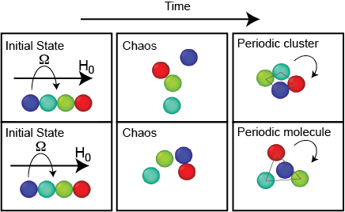
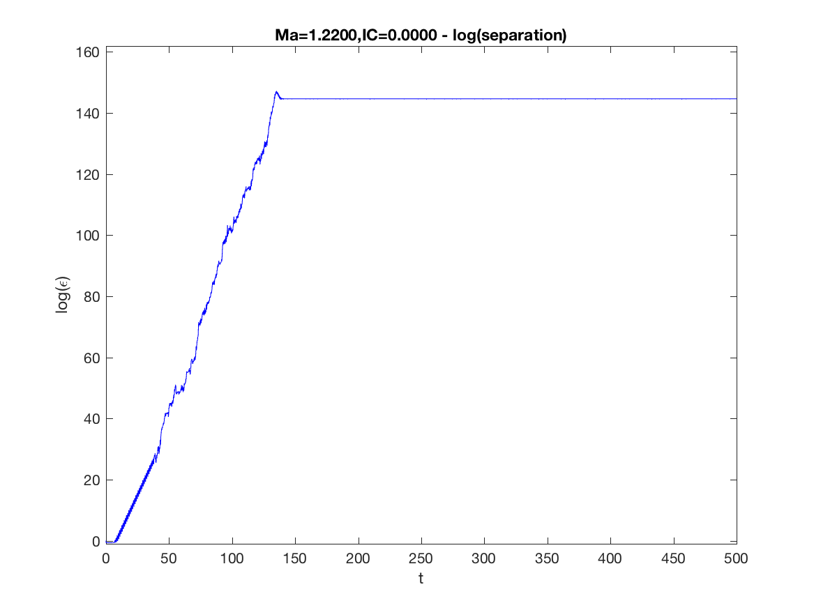
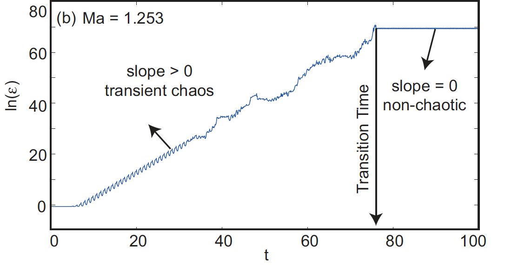

# Chaotic Routes From Chains To Compact Structures
In this repository, I share my first PhD paper, a piece of MATLAB code that re-generates one of my most significant PhD results (corresponding to Fig. 4b in the paper) and a movie from experiments that we conducted to validate this result.

## Background
In my Phd, I studied short chains of paramagnetic particles submerged in a fluid and subjected to an external rotating magnetic field. These particle systems have many proven and potential applications in microfluidics, optics and bio industry. The uploaded paper is my first PhD paper that discusses one of my most significant PhD results: above a critical rotational frequency of the field, the chain of the particles breaks up and particles undergo an episode of chaotic motion which is temporary. The long term response of the particles is forming ordered, rotating and stable structures. 

First, I discovered this regime of behavior in the simulations that I ran:

Then, we ran experiments and validated the simulation outcome: 

## Tangent Dynamics Analyis 
In order to systematically capture the transition time from chaos to order I had to do tangent dynamics analysis. I am not going to go into the details of the analysis, however, I am sharing the code in this repository. If you run the MATLAB code you will get the following figure. A positive slope means chaos and a zero slope mean order. The sharp change in slope is representative of the sharp transition from chaos to order. 

I have also attached a movie from real experiments that capture this sharp transition from chaos to order: experiment_chaos_order_transition.mp4

