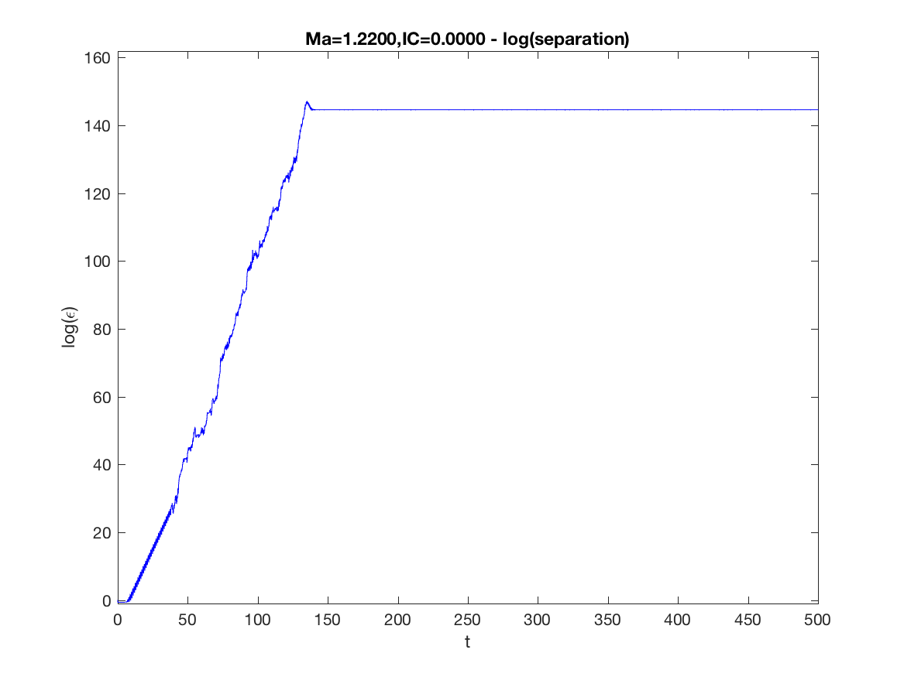

# Chaos to Order Transition
In this repository, I share my first PhD paper, a piece of MATLAB code that re-generates one of my most significant PhD results (corresponding to Fig. 4b in the paper) and a movie from experiments that we conducted to validate this result.

In my Phd, I studied short chains of paramagnetic particles submerged in a fluid and subjected to an external rotating magnetic field. These particle systems have many proven and potential applications in microfluidics, optics and bio industry. The uploaded paper is my first PhD paper that discusses one of my most significant PhD results: above a critical rotational frequency of the field, the chain of the particles breaks up and particles undergo an episode of chaotic motion which is temporary. The long term response of the particles is forming ordered, rotating and stable structures. 

If you run the MATLAB code you will get the following figure. The sharp change in slope is representative of the sharp transition from chaos to order. 

I have also attached a movie from real experiments that capture this sharp transition from chaos to order: experiment_chaos_order_transition.mp4

