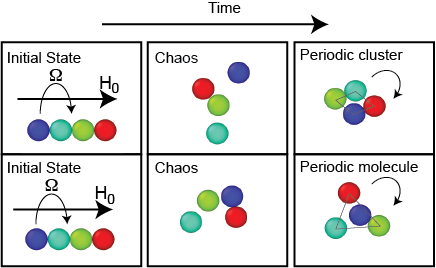

# Chaotic Routes From Chains To Compact Structures
In this repository, I describe my most significant PhD result. 

## Background
In my Phd, I studied short chains of paramagnetic particles submerged in a fluid and subjected to an external rotating magnetic field. These particle systems have many proven and potential applications in microfluidics, optics and bio industry. I discovered in my simulations that above a critical rotational frequency of the field, the chain of the particles breaks up and particles undergo an episode of chaotic motion which is temporary. The long term response of the particles is forming ordered, rotating and stable structures. In the case of four particles, the final structure is either a closed-pack cluster or a more disperesed molecule with one particle in the middle and three others orbiting it: 

Then, we ran experiments to validate the simulation outcomes and found both final states: 

Watch a video from experiments where the particles form a stable cluster after going through chaotic motion: https://www.youtube.com/watch?v=bA2_DzKMJ_A  

## Population Dynamics
In order to systematically capture the transition time from chaos to order I used a technique called tangent dynamics analysis. The following is the output of tangent dynamics at Mn = 1.253 (where Mn is the non-dimensional frequency of the external filed). A positive slope means chaos and a zero slope means order. The sharp change in slope is representative of the sharp transition from chaos to order. 

I ran this analysis for 500 different initial conditions at Mn = 1.253 and recorded the transition times. It turns out that the transition out of the chaotic state follows a first order Poisson's process. The survaival probability in chaotic state decays exponentially in time. The possibility of observing a cluster or a molecule as the final state is a constant in asymptotic time. 

## Code
I have attached the MATLAB code that performs tangent dynamics analysis. 

